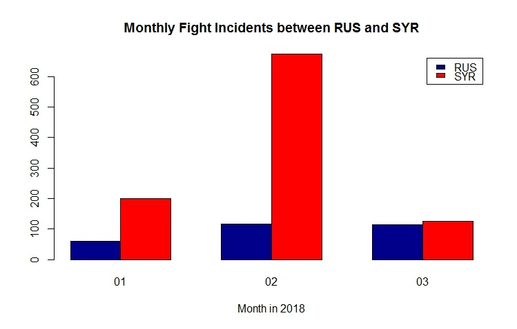

# UTDEventData ver. 1.0.0

The UTDEventData R package provides an interface to extract data from the UTD Event Data server. This package is stable and actively maintained/updated. Your comments, feedback and suggestions are welcome.   
If you have any question regarding the package, please contact Kate Kim (<hyoungah.kim@utdallas.edu>), or open an issue (<https://github.com/KateHyoung/UTDEventData/issues>).

This package is part of the "Modernizing Political Event Data for Big Data Social Science Research" project. More information can be found on [the project webpage](http://eventdata.utdallas.edu/data.html).

Several functions to preview and download data are listed below. More details of these methods are illustrated in the vignette. 

- citeData( ): for citing the package and data tables in the UTD server for publications
- DataTables( ): for looking up data tables in the UTD server 
- tableVar( ): for looking up the variables of a data table
- previewData( ): for previewing the data structure of a data table
- pullData( ): for downloading data by countries and time periods 
- entireData( ): for downloading an entire data table
- getQuerySize(): for measuring the size of requested data from the UTD server
- sendQuery( ): for requesting built queries from the API server to download data
- Table: a reference class 

****

Leaf Query Block functions:

- returnTimes( ): create a query block by time periods
- returnCountries( ): create a query block by countries
- returnLatLon( ): create a query block by latitude and longitude
- returnDyad( ): create a query block of a dyad for both source and target actors
- returnRegExp( ): create a query block by pattern of attributes in a data table

Branch Query Block functions:

- orList( ): match records that satisfy any of the child query blocks 
- andList( ): match records that satisfy all of the child query blocks 

## Installation

Without the vignette:
```
devtools::install_github("KateHyoung/UTDEventData") 
```

With the vignette:
```
devtools::install_github("KateHyoung/UTDEventData", build_vignettes=TRUE)
```

## Retrieve an API key

Access to the UTD data server requires an API key. To obtain an API key, follow the link and fill the form: <http://eventdata.utdallas.edu/signup>.

## Using the API key
#### Method 1: Pass the key as the first argument
You will need to pass the key on every function call.  
```
k <- '...your API key....'
DataTables(utd_api_key = k)
```

#### Method 2: Store the key in an environment variable 
Set the default API key by setting the environment variable `UTDAPIKEY`.
```
Sys.setenv(UTDAPIKEY = "...your API key...")

DataTables()
tableVar(table = "icews", lword = "target")
```
*Note: Method 2 currently works only with `DataTabes()`, `tableVar()`, and `previewData()`. We plan to expand this method to other functions that require an API key.*

Further examples will assume the api key is set in an environment variable. 

## Data Preview
Retrieve a sample of 100 observations.  
```
dataSample <- previewData(table_name = "PHOENIX_RT")
View(dataSample)
```
## Data Download (quick) 
`pullData()` can be used to retrieve data subsetted by country names and dates. 
```
subset1 <- pullData(table_name = "phoenix_rt", country = list('canada','China'), start = '20171101',  end = '20171102', T)
```

## Data Download (custom)
More complex queries with intersections, unions and multiple sets of constraints may be submitted via the `sendQuery()` function. More details on this method are provided in the vignette.  


## Example Usage
   
```
dt <- pullData('utd_api_key', "Phoenix_rt", list("RUS", "SYR"), start="20180101", end="20180331", citation = F)

## querying the fight event by CAMEO codes

Fgt <- dt[dt$code %in% c("190", "191", "192", "193", "194", "195", "1951", "1952", "196"),]
Fgt <- Fgt[,1:23] ## remove url and oid columns

tb <- table(Fgt$country_code, Fgt$month) # monthly incidents

barplot(tb, main = "Monthly Fight Incidents between RUS and SYR", col=c("darkblue", "red"),
        legend = rownames(tb), beside=TRUE,  xlab="Month in 2018")
```

{width=70%}

Military related fights between Russia and Syria from January 2018 to March 2018 are depicted by month. Event types are articulated by [CAMEO codes](http://eventdata.parusanalytics.com/data.dir/cameo.html) in Phoenix real-time data. 

## Vignette
Access the vignette by executing the following R snippet. This requires an initial package installation with `build_vignette=TRUE`.

```
vignette("UTDEventData")
```
Alternatively, download the PDF version [here](https://github.com/KateHyoung/UTDEventData/raw/UTDEventData/UTDEventData.pdf)


## Authors  
HyoungAh (Kate) Kim <hyoungah.kim@utdallas.edu> (Maintainer)  
Dr. Patrick T. Brandt <pbrandt@utdallas.edu>  
Dr. Vito D'Orazio <dorazio@utdallas.edu>  
Dr. Latifur Khan <lkhan@utdallas.edu>  
Michael J. Shoemate <michael.shoemate@utdallas.edu>   
Sayeed Salam <sxs149331@utdallas.edu>  
Jared Looper <jrl140030@utdallas.edu>    
 
 
## Community Guidelines
This project is released with a [Contributor Code of Conduct](CONDUCT.md). By participating in this project you agree to abide by its terms. Feedback, bug reports, and feature requests [here](hhttps://github.com/KateHyoung/UTDEventData/issues). You may request to store a dataset in the UTD Event Data server by contacting one of the authors. Those who request to store data as collaborators also agree to abide by its terms specified in the [Contributor Code of Conduct](CONDUCT.md).


## License
GPL-3 <br/>
*This package is supported by the RIDIR project funded by National Science Foundation, Grant No. SBE-SMA-1539302.*
