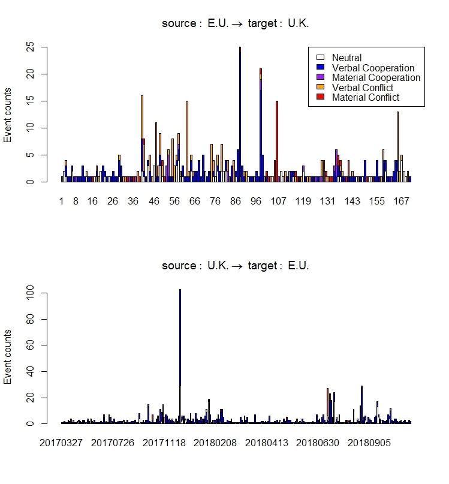

# Introduction

The R library, `UTDEventData`, provides the direct access to the political event database at the University of Texas at Dallas (UTD). Using this library, researchers can query the event data stored at the UTD's API server and load them into R for subsequent analyses. Several functions are prepared in the library to extract and to analyze the data according to users' interests. This library also provides the citation functions not only for data tables but also or the library itself. 

The UTD API server contains the six different data tables; Real-time Phoenix, ICEWS, three other Cline's Phoenix data sets, and TERRIER. With the several searching and extracting methods in this library, political and social scientists can explore the contents of each data table and can obtain the historic and real-time data for their research.  We expect that this R library provides the better environment in accessing to the event data for R users, so the number of studies on the large scale event data will increase in this drawing of the big data age.

    Table 1:  Data Table Information       
|Data Table         | Timeline          |  Further Information|
|-------------------| :----------------:|---------------------|
|Phoenix RT         | Oct. 2017 - Today | [OEDA](http://openeventdata.org/)|
|ICEWS              | 1995 - Oct. 2018  | [ICEWS Dataverse](https://dataverse.harvard.edu/dataverse/icews)|
|Cline Phoenix NYT  | 1945 - 2005       | [Cline Center](http://www.clinecenter.illinois.edu/data/event/phoenix/)|
|Cline Phoenix FBIS | 1945 - 2005       | [Cline Center](http://www.clinecenter.illinois.edu/data/event/phoenix/)|
|Cline Phoenix SWB  | 1979 - 2015       | [Cline Center](http://www.clinecenter.illinois.edu/data/event/phoenix/)|
|TERRIER            | 1979 - 2016       | [TERRIERDATA.org](http://terrierdata.org)|

The data, _Real-time Phoenix_, are real-time political conflict event data, extracted and processed from over 380 different English written news media on a daily basis since October 2017. As increasing the number of real-time news reports on the web, the UTD research team has developed an automated machine-coded system, titled "Spark-based Political Event Coding (SPEC)", in order to extract the political event data in a real time manner based on the Conflict Analysis and Mediation Event Ontology (CAMEO) event dictionary. Along with the other event data illustrated in Table 1, therefore, we expect that _Real-time Phoenix_ will be employed to explore immediate changes of international relations  and situations for academic and government communities. 

The project of the UTDEventData R package is in progress and has been updated day by day. Your comments, feedback, and suggestions are welcome so that more user friendly functions are prepared in the library.
If you have questions in using the package, please contact Kate Kim (<hyoungah.kim@utdallas.edu>). 

This package requires you to have an API key to access to the UTD data server. Please find the following link and fill out the form to obtain an API key: <http://eventdata.utdallas.edu/signup>. 

You can install the package from the UTDEventData GitHub page in R with the following syntax.
```{r, eval = FALSE}
# install the package without the vignette
devtools::install_github("KateHyoung/UTDEventData")

# install the package with the vignette
devtools::install_github("KateHyoung/UTDEventData", build_vignettes=TRUE)
```

To cite the package, an execution function `citation()` can be used, and users can find the citation texts when using the data obtaining functions, `pullData()` and `sendQuery()` with a default option of `citation = TRUE`. Moreover, the function of `citeData()` in the package will print data citation texts in a R console. 
```{r, eval = FALSE}
# to cite the package 
citation("UTDEventData")

# to cite a data table
citeData(table_name = "Data table name")
```


## Computer Environments This Package Has Tested
The codes/functions in this documentation have been tested in the following versions of:

  - Microsoft Open R 3.4.0 
  - R-3.4.3 for Windows (32/64 bit)
  - OS X 10.12.2
  - R-2.4.3 for Mac
  
&nbsp;

# Functions

## Searching functions

The search functions help users to explore 1) the data tables in the UTD API server and 2) the attributes (variables) in a particular table. Moreover, users can view the 100 sample data of each data table so as to check its structure, particular values, and patterns of attributes before downloading them on your local machines.

`DataTables()` returns a list of all data tables in the UTD server. 

```{r,eval = FALSE}
# returning all data table the server contains with entering an API key
DataTables(utd_api_key = " ")
"'PHOENIX_RT', 'CLINE_PHOENIX_SWB', 'CLINE_PHOENIX_FBIS', 'CLINE_PHOENIX_NYT', 'ICEWS'"

# suggesting a way to avoid repetitive typing an API key into functions
k <-"...api key...."
DataTables(k)
"'PHOENIX_RT', 'CLINE_PHOENIX_SWB', 'CLINE_PHOENIX_FBIS', 'CLINE_PHOENIX_NYT', 'ICEWS'"
```

`tableVar()` returns a list of variables (attributes) in a particular data table a user specified in the function. For example, the variables in the Phoenix real-time (RT) data table can be obtained as follows. 

```{r, eval = FALSE}
tableVar(utd_api_key="...", table = "phoenix_rt")

# an easy way of applying a stored API text to avoid the repeation of API key typing 
k <-"...api key...."
tableVar(k, "Phoenix_rt")

tableVar(k, "Icews")

tableVar(k, "Cline_Phoenix_swb")
```

This function is __not__ case sensitive, so users may type either lower case or upper case of a data table name. However, a text of the full name as returned by `Table()` should be entered in the function when applying the table name in other functions. For example, inputs of `"cline_Phoenix_swb"` and `"CLINE_PHOENIX_SWB"` will return the same variables, but one of `"cline_phoenix"` will return a message that ask users to check a table name again. 

This function has another feature that a user can look up a particular variable users may want. For example, one who may wonder the ICEWS data have a variable named "target", can type the string of 'target' as follows;

```{r, eval = FALSE }
tableVar(utd_api_key = "...", table = "icews", lword = "target")

# when a user wants to know the attribute that labeled as 'target' in ICEWS
k <- "..api key..."
tableVar(k, table="icews", lword="target")
'" Target Name"    " Target Sectors", ....'
```


`previewData()` shows 100 observations of a data table as an example. Occasionally, users need to know a pattern of variables or a data structure to analyze the data in R dataframes. This function can be useful when users want to see some patterns of an interesting variable to build a query block with a regular expression (`returnRegExp()`) function. 

```{r, eval = FALSE }
dataSample <- previewData(utd_api_key = " ", table_name = "PHOENIX_RT")
View(dataSample)
```

&nbsp;

## Subsetting function I

This library provides two ways of event data downloading from the UTD server. The first way is fixed and simple as entering only countries' names and time ranges through `pullData()`. The second way is flexible and extensible as allowing users to build and combine multiple data queries such as time, locations, event features, and so on. 

`pullData()` returns a list of data and citation texts. 

An input format of dates is "YYYYMMDD", and a time range should be within a time period a dataset contains as illustrated in Table 1. If the given time range in the function falls outside dataset's timeline, the function will return `list()` as its result. That means the requested data are empty.

The country indicates the geolocation of events such as the places in which a particular event happened in a news article. The country inputs can be either full names or the ISO-Alpha3 code. In this inputs, please use a consistent format when you type countries names. We recommend the ISO-3 code format in order to reduce systemic errors in the function.

The function returns citation texts \& BibTeX for publication at the end of data retrieval. To avoid printing them in your R-console, please turn off the `citation` option by logically choosing "FALSE" in the function. 

The following code is an example usage of `pullData()`. 

```{r, eval = FALSE}
## several examples of different data tables with citation texts
k <-'utd api key...'
subset1 <- pullData(utd_api_key = k, table_name = "phoenix_rt", country = list('canada','China'), start = '20171101',  end = '20171102', T)

# to store the data only
data <- subset1$data

# to print the citation texts
subset1$citation

# to avoid the citation texts
data <- pullData(k, "phoenix_rt", list('canada','China'), '20171101', '20171102', 
         citation = FALSE)
```

#### _Note_   
As illustrated, data are able to be retrieved by the country names and time ranges a user specified. A country in a data set means the country where a particular event happened. This country might not be the same with the source or target countries of an event. A researcher should pay attention to this attribute when conducting research. This feature of each variable can be scrutinized by exploring the variables of a sample data downloaded by `tableVar()` or `previewData()`. 


### Handing an API key

Throwing an API key into functions every time could be annoying tasks for users. To avoid troublesome work, we suggest some convenient approaches. 

#### Store an API key in a R memory
This approach is to simply store an API key in a global environment of R and call it when you want to use it. Although it is simple, the API key should be re-entered when a R is re-run. 
```{r, eval=FALSE}
k <- '...your API key....'
DataTables(k)
```

#### Store an API key as an environment variable 
This option is to declare user's API key as an environment variable and use it by `Sys.getenv()`. This option helps users to avoid a hassle to input the key each time. 
```{r, eval=FALSE}
Sys.setenv(UTDAPIKEY = "...your API key...")
DataTables(Sys.getenv("UTDAPIKEY"))
```


#### Using a reference class
Third option is using a reference class, named `Table()` , prepared in this library. One downside of this is that the function works only with `DataTables()`, `tableVar()`, and `pullData()`. 
```{r, eval=FALSE}
# creating an object
obj <- Table$new()

# setting an object of an API key
obj$setAPIKey("....")
obj$DataTables()  # returns the available data tables in the UTD server
obj$tableVar("cline_Phoenix_NYT")

# when a user wants to subset real-time data ('phoenix_rt) from 20171101 to 20171102 on MEX(Mexico)
obj$pullData("Phoenix_rt", list("MEX"),start="20171101", end="20171102")
```

### Extracting the entire data for a particular data set
Someone may want to download the entire data of a certain data table. `entireData()` helps users to do this as specifying a data table into the function. This function returns a dataframe of the requested data with the package citation. The data are directly stored to your disk, so make sure that your device has enough space to store them. The size of data can be estimated by `getQuerySize( )` with the  `entire` options. More details are illustrated in a help page of `getQuerySize()`. 

Some data tables are greater than 10GB, so it may occur R errors if a local devise does not have enough space. If it is the case, please increase your memory allocated to your R. The large data usually takes a longer time to request and download them, so please check your memory and disk limits before obtaining the entire data.  

```{r, eval=FALSE}
# to estimate the data size of the entire Cline_Phoenix_NYT data
getQuerySize(utd_api_key = , table_name ='Cline_Phoenix_NYT', query = 'entire')

# to download the data
data.nyt <- entireData(utd_api_key = , table_name ='Cline_Phoenix_nyt', citation = FALSE)
View(data.nyt)
```

&nbsp;

## Subsetting functions II

The second method to extract data from the UTD API server is more flexible and extensible as allowing users to build their own queries. Some functions in this method require an API key like `pullData()` so users need to enter it more frequently to subsequent functions compared to `pullData()`.  For instance, while `pullData()` function provides fixed query options such as country names and time ranges, the method of subsetting functions II facilitates users to have more discretion in creating queries such as country names, time ranges, a dyad of actors, latitude \& longitude of event locations, and source \& targets indications of certain events. By combining query blocks, users can retrieve data at their own choices. 

The subsetting function II consists of three groups. The first method is a data requesting function, which requests the data set to the server with built query blocks: `sendQuery()`.  The second group is creating query blocks according to the user's preference. These query blocks are the basis of subsetting information such as country names, locations (latitude and longitude), time ranges, a dyad relation, and so on. Moreover, a user can use any variable (attribute) in an API data table with the regular expression function, `returnRegExp()`. The last group of is the connective functions of query blocks: `orList()` and `andList()`. These functions play a role of a logical operator to combine the query blocks as union and intersection respectively.

While these functions provide flexible methods to build queries, usage is not simple and may return some errors depending on environments of local machines. To obtain data without error messages, users must acquaint each function's usage illustrated in this document or help pages in the library. The details of how individual function works together with the other functions are illustrated in the following section. 

### Data request function

A dataset can be retrieved with the combinations generated with query block functions. `sendQuery()` is a main function to request data to the API server. A user should input an API key, a data table, and a list of queries created by `andList()`, `orList()`, or a single query block in the function as shown in the following example code. The function print the citation texts of publication and BibTeX formats at the end of the extracted data as default. To avoid this printing, please turn off the option by choosing "FALSE" in the method.

`sendQuery()` returns a list of data and citation.

```{r, eval = FALSE}
# basic usage
sendQuery(utd_api_key='', tabl_name ='', query = c(), citation = TRUE)

# to store the ICEWS subset in the vector of myData without the citation
# query_block is a list of the quries built by the query block functions illustrated in subchapters
dyad <- returnDyad('icews', 'PAK', 'IND')
time <- returnTimes("icews","20180901","20181031")
query_block <- andList(c(time, dyad))
myData <- sendQuery('utd_api_key',"icews", query_block, citation = TRUE)
# store the data only
myData <- myData$data
# print citation texts only
myData$citation

# without the citation text
myData <- sendQuery(utd_api_key,"icews", query_block, citation = FALSE)
```

### Query block functions

`returnRegExp()` can be used for a special case as indicating a particular value or a pattern of the variables in the API data table. To use this function, a user must aware the pattern of a variable in a certain data table. The variable list in a particular table can be found with the function of `tableVar()` in the package and the pattern can be confirmed by `previewData()`. The function requires users to have an API key, and a data table name, a pattern of interest events, and a field name (attribute or variable) in a data table.

This function returns a list of specified queries. 

```{r, eval = FALSE}
# genrate a query for all source actors that involved in governments in events
govQuery <- returnRegExp( utd_api_key = " " , table_name = "phoenix_rt", pattern = "GOV", field = "src_agent")
# to subset the cline_phoenix_nyt data by year == 2001
nytQuery <- returnRegExp( utd_api_key = " ", 'cline_phoenix_nyt', '2001', 'year')
```

`returnCountries()` is the function that creates a country query block. The country means the geo-location where a certain event occurred in a news article. The function requires users to specify the names of the data table and countries. The ISO-3 Code format is recommended for its input, but full country names can work in the function. The inputs are __case-insensitive__. But we recommend to use a consistent way in the country name input. 

```{r, eval = FALSE}
# generate a query of the United States and Canada as a country restraint for real-time event data
ctr <- returnCountries(table_name = "phoenix_rt", country = list("USA","CAN"))
```   

`returnTimes()` is the function that generates a time range query block. The format of typing time should be "YYYYMMDD" in the order of the start and the end points of the time range. A user must identify a data table in the function. 

```{r, eval = FALSE}
# generates a query to return all events between July 27, 1980, and December 10, 2004 for ICEWS data
time <- returnTimes(table_name = "icews",  start = "19800727", end = "20041210")
``` 

`returnLatLon()` returns the list of geo-location boundary a user specifies with latitudes and longitudes. This function does not require a data table name, but the input should be ordered by `lat1, lat2, lon1, lon2`. They are respectively the minimum and maximum values of the latitudes and longitudes of the boundary. 

```{r, eval = FALSE}
# generate a query with a geo-location bountry with the latitude between -80 and 30 and the longitude between 20 and 80
locQuery <- returnLatLon(lat1 = -80, lat2 = 30, lon1 = 20, lon2 = 80)
```

The `returnDyad()` function creates a query of particular dyads of actors in country formats. In the function, a user must specify a table name and source and target countries respectively. The ISO-3 codes for country names are recommended as function inputs, but full names of countries also work in this function. These inputs are not case-sensitive. 

```{r, eval = FALSE}
# genrate a query that a source country is Syria and a target country is the United States
dyad <- returnDyad(table_name =" " , source = "SYR", target = "USA")
```


### Connective functions 

These functions play a role to connect several query elements created by the aforementioned functions. The two functions, `andList()` and `orList()`, work as logical operators, **"and"** and **"or"**, respectively. `andList()` is the function that returns the list of an intersection of two or more query blocks. The stored queries should be specified in the `c()` format in the function. `orList()` returns the list of a union of two or more query blocks. The stored queries should be specified in the `c()` format in the function as shown in the following examples. 

```{r, eval = FALSE}
# combine stored query blocks such as 'time' or 'locQuery' created before
and_query <- andList(query_prep = c(locQuery, time))

# subset with two or more stored query blocks such as 'locQuery' or 'dyad'
or_query <- orList(query_prep = c(locQuery, dyad))
```


Please note that you may have an error if the large size of data is extracted by `sendQuery()`. More specifically, the issue can more frequently come with the `orList()` function, so you may encounter the memory issue when using `orList()` with several query blocks. Once the issue occurs, please increase a memory size allocated to your R  and re-run the functions. If a user keeps having the issue, please consider using `pullData()` for data subsetting. `pullData()` works more efficiently than `sendQuery()`. Specific information is illustrated in the next section.


### An error message from `sendQuery()` 
The aforementioned issue in  `sendQuery()` can occur when the size of requested data is greater than memory allocated to R. The error message will suggest a solution such as increasing a memory size of a user's computer with the original error. 

This issue is more frequently occurred in a Windows machine because of the memory cap the R program is assigned. Once a user has the issue, `getQuerySize()` should be drawn to estimate data sizes. After comparing the size of data to machine' RAM, a user may need to increase its maximum. If you apply `"entire"` in the query option, you can find the total size of a certain data table. 

please see the following examples;

```{r, eval = FALSE}
# estimate the data size you want to extract
getQuerySize(utd_api_key = " ", table_name = " ", query = list())

# if the error message is noted, estimate the data a user has requested
getQuerySize(k, 'phoenix_rt', q)

# check your memory limit only in the Windows system
memory.limit()

# increase its size if you need 
memory.size(max=120000)   
```

&nbsp;

## Data citation function

`citeData()` function returns the list of citations texts for the data and this R library for journal publication or research documentation. The returned text contains two different type of citations; 1) citation texts for a user to copy and paste them to journal papers or other documents, and 2) BibTeX text for \LaTeX users. The input for table names in this function is case-insensitive, but you should have full data table names. 

```{r, eval = FALSE}
# for the citations for Cline Phoenix Event data
citeData(table_name = "cline_Phoenix_swb")

# for the citations for UTD real-time data 
citeData(table_name = "Phoenix_rt")

# for the citations for ICEWS  
citeData(table_name = "ICEWS")
```

&nbsp;

# Usage examples

A user should prepare the R library and an API key from the UTD API server. Again, an API can be obtained on the sign-up page: <http://eventdata.utdallas.edu/signup>. 


## Example 1 - extracting data by a time range and countries
+ Extracting data with countries and time can be achieved with two ways in this package: 1) `pullData()` and 2) `sendQuery()`. This example shows how to complete the following task with the two methods. 
+ Task: After extracting all real-time event data between Russia and Syria from 20180101 to 20180331, draw the bar graphs by types of fights defined in the CAMEO code:

```{r, eval = F, fig.height=3, fig.width=5}

# Option 1: pullData() 
# Note: k <- "...provided API key"
dt <- pullData(k, "Phoenix_rt", list("RUS", "SYR"),start="20180101", end="20180331", citation = F)

# Option 2: SendQuery() and the query block functions: returnTimes(), returnCountries()

ctr<- returnCountries("Phoenix_rt", list('RUS', 'SYR'))
t <- returnTimes("Phoenix_rt", "20180101", '20180331')
q <- andList(c(ctr, t))
dt1 <- sendQuery(k, "Phoenix_rt", q, citation = F)

## querying the fight event by CAMEO codes
Fgt <- dt[dt$code=="190" | dt$code=="191" | dt$code=="192" |
          dt$code=="193" | dt$code=="194" | dt$code=="195" |
          dt$code=="1951" | dt$code=="1952" | dt$code=="196",]

Fgt <- Fgt[,1:23] ## removing url and oid

tb <- table(Fgt$country_code, Fgt$month) # monthly incidents

barplot(tb, main = "Monthly Fight Incidents between RUS and SYR", col=c("darkblue", "red"),
        legend = rownames(tb), beside=TRUE,  xlab="Month in 2018")

```
{width=70%}


## Example 2 - using a dyad query block and `sendQuery()`
+ Comparing the data set with the consistent query that Pakistan is the source and India is the target of events:
```{r, eval=FALSE, message=FALSE, warning=FALSE, results="asis"}
# creating the query of source = 'PAK' and target = 'IND' for ICEWS
query <- returnDyad('icews', 'PAK', 'IND')
tmp <- sendQuery(k, 'icews', query, citation = F)
# the query for Phoenix_Cline_SWB
q.cline.swb <- returnDyad('cline_phoenix_swb', 'PAK', 'IND')
tmp.swb <- sendQuery(k, 'cline_phoenix_swb', q.cline.swb, F)
# the query for Phoenix_Cline_FBIS
q.cline.fbis <- returnDyad('cline_phoenix_fbis', 'PAK', 'IND')
tmp.fbis <- sendQuery(k, 'cline_phoenix_fbis', q.cline.fbis, F)
# the query for Phoenix_Cline_NYT
q.cline.nyt <- returnDyad('cline_phoenix_nyt', 'PAK', 'IND')
tmp.nyt <- sendQuery(k, 'cline_phoenix_nyt', q.cline.nyt, F)
# save each observation as a data set and print it
Compare <- as.matrix(cbind(nrow(tmp), nrow(tmp.swb), nrow(tmp.fbis), nrow(tmp.nyt)))
colnames(Compare) <- c("ICEWS", "Phoenix SWB", "Phoenix FBIS", "Phoenix NYT")
knitr::kable(Compare)
```

    Table 2:  The Result of Example 2  
| ICEWS   | Phoenix SWB | Phoenix FBIS | Phoenix NYT|
|:------:|:-----------:|:------------:|:----------:|
|40731   |1140         | 633          | 272        | 


## Example 3 - Designing complex queries, with `returnRegExp()`
Users may need to create the query elements that are unable to build with prepared functions in this package. For users discretion in building queries, `returnRegExp()` provides flexible options to extract the data by the feature of an attribute in each data table. The following code chuck will illustrate some examples of complex queries.   

+ Task: After extracting the data set of 'source': IGOEUREEC (EU) and 'target': United Kingdom (UK) and the one of _vice versa_ from the real-time Phoenix data, create the graphs of their trends:

```{r, eval=FALSE, message=FALSE, warning=FALSE, results="asis" }
# sorce actor is EU
eu <- returnRegExp(k,"Phoenix_rt","IGOEUREEC", "source")
# target actor is UK
uk <- returnRegExp(k,"Phoenix_rt","GBR", "target")
dyad1 <- andList(c(eu,uk))
dd1 <- sendQuery(k, "Phoenix_rt", dyad1, F)

# source actor is UK
uk2 <- returnRegExp(k,"Phoenix_rt","GBR", "source")
# target actor is EU
eu2 <- returnRegExp(k,"Phoenix_rt","IGOEUREEC", "target")
dyad2 <- andList(c(eu2,uk2))
dd2 <- sendQuery(k, "Phoenix_rt", dyad2, F)

# reshaping data
EU_UK <- as.data.frame(table(dd1$date8, dd1$quad_class))
colnames(EU_UK) <- c("day", "quadclass", "count")
EU_UK  <- reshape(EU_UK, idvar = "day", timevar = "quadclass", direction = "wide")
colnames(EU_UK) <- c("date","qc0","qc1","qc2","qc3","qc4")
EU_UK <- t(EU_UK)
EU_UK <- EU_UK[-1,]

UK_EU <- as.data.frame(table(dd2$date8, dd2$quad_class))
colnames(UK_EU) <- c("day", "quadclass", "count")
UK_EU  <- reshape(UK_EU, idvar = "day", timevar = "quadclass", direction = "wide")
colnames(UK_EU) <- c("date","qc0","qc1","qc2","qc3","qc4")
UK_EU <- as.matrix(UK_EU)
UK_EU <- t(UK_EU)
colnames(UK_EU) <- UK_EU[1,]
UK_EU <- UK_EU[-1,]

# plotting
par(mfrow=c(2,1))
barplot(EU_UK, col=c("white","blue","purple","orange", "red"),
        ylab= "Event counts",
        main = expression(source:~E.U. %->% ~target:~U.K.))
legend("topright", c("Neutral", "Verbal Cooperation", "Material Cooperation",
                     "Verbal Conflict", "Material Conflict"),
       fill=c("white","blue","purple","orange", "red"))
barplot(UK_EU, col=c("white","blue","purple","orange", "red"),
        ylab= "Event counts",
        main = expression(source:~U.K. %->% ~target:~E.U.))
```


{height=75%, width=85%}

&nbsp;

# Further information of the Event Data server at UTD

## Real Time Event Data 
[The web-page of the real-time event data project](http://eventdata.utdallas.edu/)  
The web portal contains the general information about the real-time event data project conducted in the University of Texas at Dallas. As the portal site of the project, the basic information of the project and its outcome including related web-links are listed and organized. 

## Spec-real-time Server
[The GitHub page for the API access on Jetstream at UTD](https://github.com/Sayeedsalam/spec-event-data-server)  
This GitHub page provides specific information of the direct access to the UTD server managed by Big Data Management and Analytic Lab with Mongo DB query syntax. The queries are expressed in JSON format. 

## Jetstream
[Jetstream user guide](https://portal.xsede.org/jetstream)  
XSEDE user guide provides specific information of the Jetstream usage and its working system. You can explore other information of Jetstream in the linked websites. 


